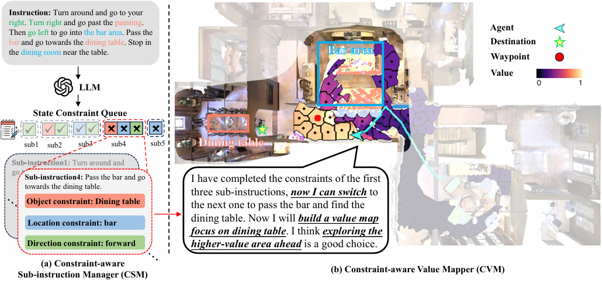
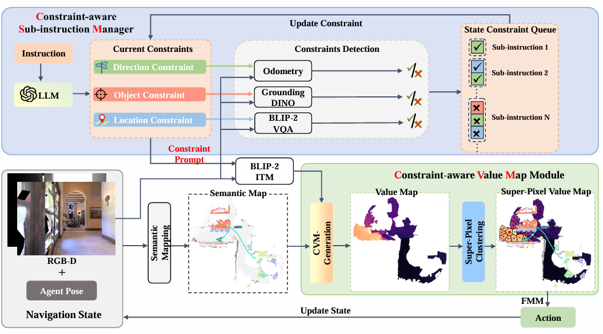
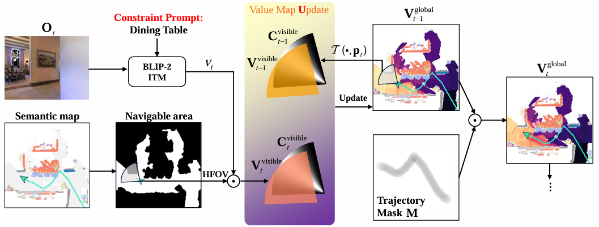

<div align="center">

<h1>Constraint-Aware Zero-Shot Vision-Language Navigation in Continuous Environments</h1>

<div>
    <a href='https://github.com/Chenkehan21' target='_blank'>Kehan Chen*</a>;
    <a href='https://marsaki.github.io/' target='_blank'>Dong An*</a>;
    <a href='https://yanrockhuang.github.io/' target='_blank'>Yan Huang</a>;
    <a href='https://scholar.google.com/citations?hl=zh-CN&user=_IUq7ooAAAAJ&view_op=list_works&sortby=pubdate'>Rongtao Xu</a>;
    <a href='https://github.com/yifeisu' target='_blank'>Yifei Su</a>;
    <a href='https://scholar.google.com/citations?user=P2HB2bsAAAAJ&hl=zh-CN&oi=ao' target='_blank'>Yonggen Ling</a>;
    <a href='https://scholar.google.com/citations?hl=zh-CN&user=ATkNLcQAAAAJ&view_op=list_works&sortby=pubdate' target='_blank'>Ian Reid</a>;
    <a href='https://scholar.google.com/citations?user=8kzzUboAAAAJ&hl=zh-CN' target='_blank'>Liang Wang+</a>;
</div>

<!-- <h3><strong>Accepted to <a href='https://ieeexplore.ieee.org/xpl/RecentIssue.jsp?punumber=34' target='_blank'>TPAMI 2024</a></strong></h3> -->

<h3 align="center">
  <a href="https://arxiv.org/abs/2412.10137" target='_blank'>[Paper] &</a>
  <a href="https://chenkehan21.github.io/CA-Nav-project/" target='_blank'>[Project]</a>
</h3>
</div>

We address the task of Vision-Language Navigation in Continuous Environments (VLN-CE) under the zero-shot setting. Zero-shot VLN-CE is particularly challenging due to the absence of expert demonstrations for training and minimal environment structural prior to guide navigation. To confront these challenges, we propose a Constraint-Aware Navigator (CA-Nav), which reframes zero-shot VLN-CE as a sequential, constraint aware sub-instruction completion process. CA-Nav continuously translates sub-instructions into navigation plans using two core modules: the Constraint-Aware Sub-instruction Manager (CSM) and the Constraint-Aware Value Mapper (CVM). CSM defines the completion criteria for decomposed sub-instructions as constraints and tracks navigation progress by switching sub-instructions in a constraint-aware manner. CVM, guided by CSM’s constraints, generates a value map on the fly and refines it using superpixel clustering to improve navigation stability. CA-Nav achieves the state-of-the-art performance on two VLN-CE benchmarks, surpassing the previous best method by 12% and 13% in Success Rate on the validation unseen splits of R2R-CE and RxR-CE, respectively. Moreover, CA-Nav demonstrates its effectiveness in real-world robot deployments across various indoor scenes and instructions.

<div align="center">
    
    <!-- 
     -->
</div>

# Setup

## Installation

1. Create a virtual environment. We develop this project with Python 3.8:

   ```bash
   conda env create -n CA-Nav python==3.8
   conda activate CA-Nav
   ```

2. Install `habitat-sim-v0.1.7` for a machine with multiple GPUs or without an attached display (i.e. a cluster):

    ```bash
    git clone https://github.com/facebookresearch/habitat-sim.git
    cd habitat-sim
    git checkout tags/v0.1.7
    pip install -r requirements.txt
    python setup.py install --headless
    ```

3. Install `habitat-lab-v0.1.7`:

    ```bash
    git clone https://github.com/facebookresearch/habitat-lab.git
    cd habitat-lab
    git checkout tags/v0.1.7
    cd habitat_baselines/rl
    vi requirements.txt # delete tensorflow==1.13.1
    cd ../../ # (return to habitat-lab direction)
    
    pip install torch==1.10.0+cu111 torchvision==0.11.0+cu111 torchaudio==0.10.0 -f https://download.pytorch.org/whl/torch_stable.html

    pip install -r requirements.txt
    python setup.py develop --all # install habitat and habitat_baselines; If the installation fails, try again, most of the time it is due to network problems
    ```

    If you encounter some problems and failed to install habitat, please try to follow the [Official Habitat Installation Guide](https://github.com/facebookresearch/habitat-lab#installation) to install [`habitat-lab`](https://github.com/facebookresearch/habitat-lab) and [`habitat-sim`](https://github.com/facebookresearch/habitat-sim). We use version [`v0.1.7`](https://github.com/facebookresearch/habitat-lab/releases/tag/v0.1.7) in our experiments, same as in the VLN-CE, please refer to the [VLN-CE](https://github.com/jacobkrantz/VLN-CE) page for more details.

3. Install Grounded-SAM and refine its phrases2classes function

    ```bash
    git clone https://github.com/IDEA-Research/GroundingDINO.git
    cd GroundingDINO
    git checkout -q 57535c5a79791cb76e36fdb64975271354f10251
    pip install -q -e .
    pip install 'git+https://github.com/facebookresearch/segment-anything.git'
    ```

    ATTENTION: We found that optimizing the phrase-to-class mapping logic in Grounded-SAM using minimum edit distance leads to more stable prediction outputs.

    ```bash
    cd <YOUR PATH>/GroundingDINO/groundingdino/util/inference.py
    pip install nltk
    ```

    Find and comment the raw phrase2class function in Line 235, then write the refined version:
    ```python
    # @staticmethod
    # def phrases2classes(phrases: List[str], classes: List[str]) -> np.ndarray:
    #     class_ids = []
    #     for phrase in phrases:
    #         try:
    #             class_ids.append(classes.index(phrase))
    #         except ValueError:
    #             class_ids.append(None)
    #     return np.array(class_ids)

    from nltk.metrics import edit_distance
    @staticmethod
    def phrases2classes(phrases: List[str], classes: List[str]) -> np.ndarray:
        class_ids = []
        for phrase in phrases:
            if phrase in classes:
                class_ids.append(classes.index(phrase))
            else:
                distances = np.array([edit_distance(phrase, class_id) for class_id in classes])
                idx = np.argmin(distances)
                class_ids.append(idx)
        return np.array(class_ids)
    ```

4. Install other requirements

    ```bash
    git clone https://github.com/Chenkehan21/CA-Nav-code.git
    cd CA-Nav-code
    pip install requirements.txt
    pip install requirements2.txt
    ```


## Datasets
1. R2R-CE
   - Instructions:
    Download the R2R_VLNCE_v1-3_preprocessed instructions from [VLN-CE](https://github.com/jacobkrantz/VLN-CE):

   - Scenes:
   Matterport3D (MP3D) scene reconstructions are used. The official Matterport3D download script (`download_mp.py`) can be accessed by following the instructions on their [project webpage](https://niessner.github.io/Matterport/). The scene data can then be downloaded:

   ```bash
   # requires running with python 2.7
   python download_mp.py --task habitat -o data/scene_datasets/mp3d/
   ```

    Extract such that it has the form `scene_datasets/mp3d/{scene}/{scene}.glb`. There should be 90 scenes. Place the `scene_datasets` folder in `data/`.


2. CA-Nav LLM Replys / BLIP2-ITM / BLIP2-VQA / Grounded-SAM

    Download from [CA-Nav-Google-Drive](https://drive.google.com/drive/folders/1fHUDDnK-gNNABrcb5u_F93mAQhu8tC8z?usp=sharing)

Overall, datas are organized as follows:

```
CA-Nav-code
├── data
│   ├── blip2
│   ├── datasets
│       ├── LLM_REPLYS_VAL_UNSEEN
│       ├── R2R_VLNCE_v1-2_preprocessed
│   ├── grounded_sam
│   ├── logs
│   ├── scene_datasets
│   └── vqa
└── ...
```


## Running

```bash
cd CA-NAV-code
sh run_r2r/main.sh
```


# Contact Information

* kehan.chen@cripac.ia.ac.cn, [Kehan Chen](https://github.com/Chenkehan21)
* dong.an@mbzuai.ac.ae, [Dong An](https://marsaki.github.io/)
* yhuang@nlpr.ia.ac.cn, [Yan Huang](https://yanrockhuang.github.io/)

# Acknowledge

Our implementations are partially inspired by [SemExp](https://arxiv.org/abs/2007.00643) and [ETPNav](https://arxiv.org/abs/2304.03047v2).
Thanks for their great works!

# Citation

If you find this repository is useful, please consider citing our paper:

```
@article{chen2024CANav,
    title={Constraint-Aware Zero-Shot Vision-Language Navigation in Continuous Environments}, 
    author={Kehan Chen and Dong An and Yan Huang and Rongtao Xu and Yifei Su and Yonggen Ling and Ian Reid and Liang Wang},
    year={2024},
    journal={arXiv preprint arXiv:2412.10137}
}
```